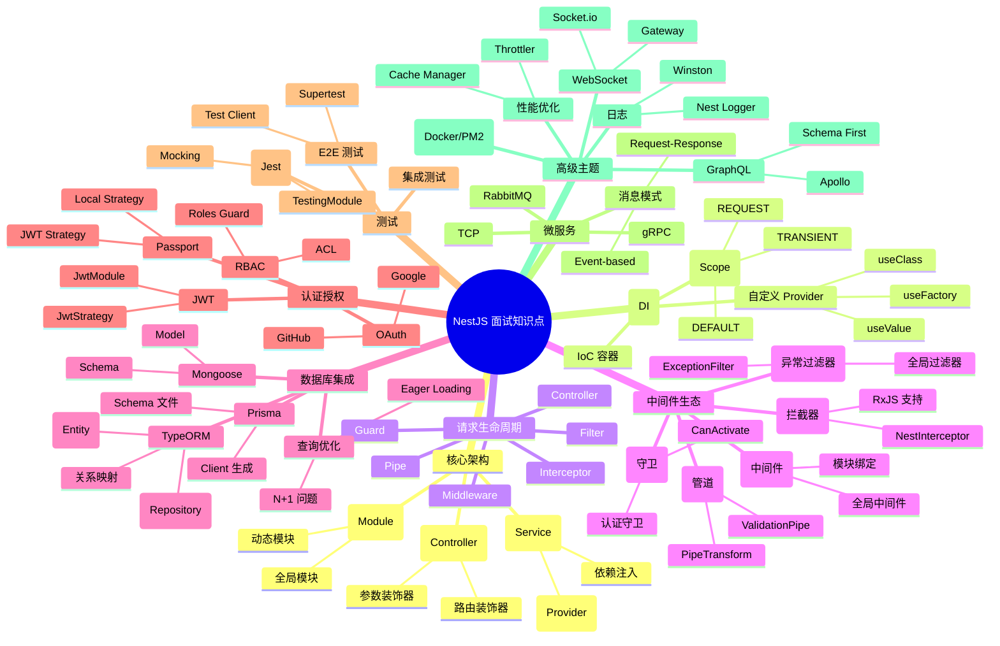

# NestJS 知识点思维导图

这份思维导图使用 Mermaid 语法绘制，覆盖 NestJS 面试核心知识点。你可以在支持 Mermaid 的工具中渲染（如 GitHub、VS Code with Mermaid Preview 插件，或 https://mermaid.live/）。

## 思维导图

## 渲染说明
- **如何查看**：复制以上 Mermaid 代码到 https://mermaid.live/ 或 Markdown 编辑器中渲染。
- **结构说明**：
  - **根节点**：NestJS 面试知识点
  - **主要分支**：按主题分类，每个分支有子节点
  - **颜色/样式**：Mermaid 默认渲染，你可以自定义

如果需要调整导图（例如添加/删除节点）或生成其他格式（如 PNG 图片），请告诉我！
